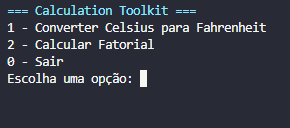
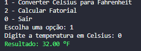
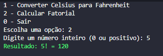

# 🧮 Calculation Toolkit


Aplicação desenvolvida em Python que oferece utilitários de cálculo via **CLI interativo** e também através de uma **API REST com Flask**.

Este projeto demonstra boas práticas de desenvolvimento, organização de código e evolução de um sistema simples para uma aplicação mais robusta.

---

## 🚀 Funcionalidades

### 💻 CLI (Terminal)

* Conversão de temperatura (Celsius → Fahrenheit)
* Cálculo de fatorial
* Validação de entrada do usuário
* Mensagens coloridas no terminal

### 🌐 API REST

* Endpoint para conversão de temperatura
* Endpoint para cálculo de fatorial
* Retorno em formato JSON
* Tratamento de erros

---

## 📁 Estrutura do projeto

```
calculation-toolkit/
│
├── main.py
├── api.py
├── services/
├── utils/
├── tests/
├── assets/
└── README.md
```

---

## ▶️ Como executar

### 🔹 CLI

```bash
python main.py
```

---

### 🔹 API

```bash
python api.py
```

A API estará disponível em:

```
http://127.0.0.1:5000
```

---

## 🌐 Endpoints

### 📌 Converter temperatura

```
GET /temperatura?celsius=25
```

Resposta:

```json
{
  "celsius": 25,
  "fahrenheit": 77.0
}
```

---

### 📌 Calcular fatorial

```
GET /fatorial?numero=5
```

Resposta:

```json
{
  "numero": 5,
  "fatorial": 120
}
```

---

## 📸 Exemplos

### 💻 CLI



---

### 🌡️ Conversão de temperatura



---

### 🔢 Cálculo de fatorial



---

## 📚 Conceitos aplicados

* Entrada de dados com `input()`
* Conversão de tipos (`int`, `float`)
* Tratamento de exceções (`try/except`)
* Modularização de código
* Uso de bibliotecas padrão (`math`)
* Criação de API com Flask
* Estruturação de projeto (clean code)

---

## 📈 Melhorias futuras

* Deploy da API na nuvem
* Interface gráfica (GUI)
* Testes automatizados mais avançados
* Documentação com Swagger

---

## 👨‍💻 Autor

Desenvolvido por Rodrigo Mayer Alves
